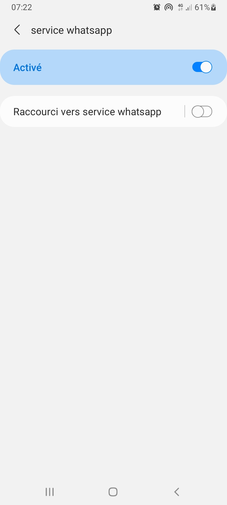

# whatsapp-accessibility-service for android

send lot of message for whatsapp contact

### how to use :

- clone depot
- active the service in accessibility service of settings android
- enter contact name and message
- send button

for stopping send message, close window whatsapp

/!\ don't stop the service in settings android, if you stop the service you need to reinstall the app

